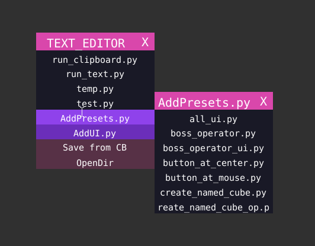
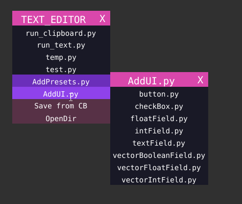

.. _text_editor_scripts:

Text Editor Scripts
======================

If you choose to use Text Editor, there are two helpful scripts placed in ``TEXT_EDITOR`` contextual menu, So
:ref:`use_space<use_space>` toggle button should be green.

AddPreset.py
--------------

This is an example of :ref:`Dynamic Menu<dynamic_menu_title>`

..  note::
    Functionality-wise this is similar too ``TextArea`` Templates pull down menu.

This will create a new TextData block. You can press ``OpenDir`` in the menu and you will find a folder named ``_add_presets_files``
you can save new files in that folder to be used as starting point template. Files in this folder are the ones shown as submenu
content of ``AddPreset.py``.

..  literalinclude:: ..\codes\_SPACES\TEXT_EDITOR\_d_AddPresets.py
    :language: python
    :emphasize-lines: 26
    :linenos:

You can see line 26 highlighted above that ``_add_presets_files`` is hardcoded. I have chosen a name that starts with
underscore so that it is not treated as normal directory and create further submenu.

AddUI.py
-----------

This is an example of :ref:`Dynamic Menu<dynamic_menu_title>`

This will append text to existing TextData block. So you can save code-snippets. Files are saved in the ``_add_ui_files``
folder.

..  literalinclude:: ..\codes\_SPACES\TEXT_EDITOR\_d_AddUI.py
    :language: python
    :linenos:

